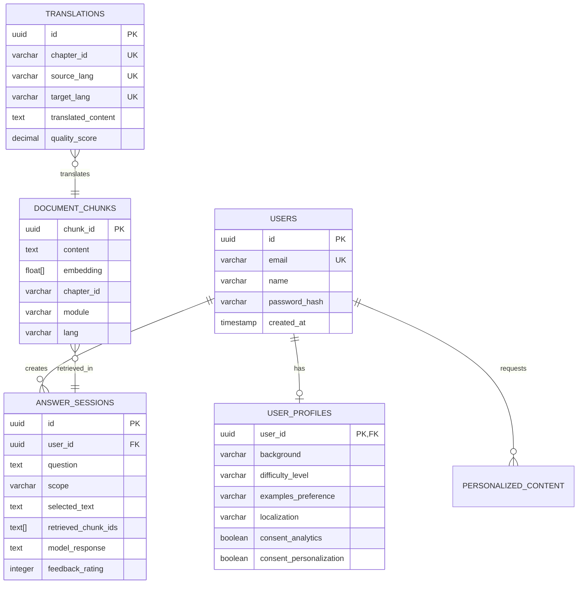

# Data Model: Physical AI Textbook + RAG Chatbot

**Feature**: 001-ai-textbook-rag-chatbot  
**Phase**: 1 - Design & Contracts  
**Date**: 2025-12-06

## Overview

This document defines the data models for the Physical AI textbook RAG system, covering:
1. Document chunks stored in Qdrant (vector embeddings)
2. User profiles and authentication in Neon Postgres
3. Answer sessions and feedback tracking
4. Translation cache and personalization state

---

## 1. Document Model (Qdrant Vector Store)

### DocumentChunk

Represents a semantically coherent chunk of textbook content with vector embedding.

**Storage**: Qdrant collection `physical_ai_humanoid_robotics_course`

**Schema**:
```python
from pydantic import BaseModel, Field
from typing import List, Optional, Literal

class DocumentChunk(BaseModel):
    """A chunk of textbook content with metadata and embedding."""
    
    # Primary identifier
    chunk_id: str = Field(description="UUID v4 for chunk")
    
    # Content
    content: str = Field(description="Raw text content (400-800 tokens)")
    embedding: List[float] = Field(description="1536-dim vector from text-embedding-3-small")
    
    # Hierarchy metadata
    chapter_id: str = Field(description="e.g., 'module-01-ros2/02-nodes-topics-services'")
    module: str = Field(description="e.g., 'module-01-ros2'")
    section: str = Field(description="Section heading, e.g., 'Publisher/Subscriber Pattern'")
    heading_path: str = Field(description="Full breadcrumb, e.g., 'Module 1 > ROS 2 > Publisher/Subscriber'")
    
    # URLs and references
    file_url: str = Field(description="Docusaurus URL path, e.g., '/docs/module-01-ros2/02-nodes-topics-services'")
    source_file: str = Field(description="Original markdown file path")
    
    # Content classification
    chunk_type: Literal["content", "code", "exercise"] = Field(description="Type of content")
    lang: Literal["en", "ur"] = Field(default="en", description="Language")
    keywords: List[str] = Field(default_factory=list, description="Extracted keywords for filtering")
    
    # Indexing metadata
    indexed_at: str = Field(description="ISO 8601 timestamp of indexing")
    chunk_index: int = Field(description="Position in source document (0-indexed)")
    total_chunks: int = Field(description="Total chunks from source document")

# Qdrant-specific configuration
class QdrantConfig:
    collection_name = "physical_ai_humanoid_robotics_course"
    vector_size = 1536
    distance = "Cosine"
    
    # Indexing parameters
    hnsw_config = {
        "m": 16,              # Number of connections per layer
        "ef_construct": 100   # Size of dynamic candidate list for construction
    }
    
    # Payload indexing for fast filtering
    payload_indexes = [
        {"field_name": "module", "field_schema": "keyword"},
        {"field_name": "lang", "field_schema": "keyword"},
        {"field_name": "chunk_type", "field_schema": "keyword"},
        {"field_name": "keywords", "field_schema": "keyword"}
    ]
```

**Validation Rules**:
- `content` must be non-empty and ≤2048 characters
- `embedding` must be exactly 1536 floats
- `chapter_id` must follow pattern `module-\d{2}-[a-z-]+/\d{2}-[a-z-]+`
- `keywords` max 10 items

**Sample Data**:
```json
{
    "chunk_id": "a7f3c8d2-4e1b-4f9a-8c3d-2e5f6a7b8c9d",
    "content": "In ROS 2, a publisher is a node that sends messages to a topic. To create a publisher in rclpy, you use the `create_publisher()` method...",
    "embedding": [0.023, -0.145, 0.389, ...],
    "chapter_id": "module-01-ros2/02-nodes-topics-services",
    "module": "module-01-ros2",
    "section": "Publisher Pattern",
    "heading_path": "Module 1: ROS 2 > Nodes, Topics, Services > Publisher Pattern",
    "file_url": "/docs/module-01-ros2/02-nodes-topics-services#publisher-pattern",
    "source_file": "frontend/docs/module-01-ros2/02-nodes-topics-services.md",
    "chunk_type": "content",
    "lang": "en",
    "keywords": ["publisher", "rclpy", "topic", "create_publisher"],
    "indexed_at": "2025-12-06T10:30:00Z",
    "chunk_index": 3,
    "total_chunks": 12
}
```

---

## 2. User Model (Neon Postgres)

### User

Represents an authenticated user with signup metadata.

**Table**: `users`

**Schema**:
```sql
CREATE TABLE users (
    id UUID PRIMARY KEY DEFAULT gen_random_uuid(),
    email VARCHAR(255) UNIQUE NOT NULL,
    name VARCHAR(255),
    password_hash VARCHAR(255) NOT NULL,
    email_verified BOOLEAN DEFAULT false,
    created_at TIMESTAMP WITH TIME ZONE DEFAULT NOW(),
    updated_at TIMESTAMP WITH TIME ZONE DEFAULT NOW(),
    last_login TIMESTAMP WITH TIME ZONE,
    
    CONSTRAINT email_format CHECK (email ~* '^[A-Za-z0-9._%+-]+@[A-Za-z0-9.-]+\.[A-Z|a-z]{2,}$')
);

CREATE INDEX idx_users_email ON users(email);
CREATE INDEX idx_users_created_at ON users(created_at DESC);
```

**Python Model**:
```python
from pydantic import BaseModel, EmailStr, Field
from datetime import datetime
from typing import Optional

class User(BaseModel):
    id: str = Field(description="UUID v4")
    email: EmailStr
    name: Optional[str] = None
    password_hash: str = Field(exclude=True)  # Never expose in API
    email_verified: bool = False
    created_at: datetime
    updated_at: datetime
    last_login: Optional[datetime] = None
    
    class Config:
        from_attributes = True  # For SQLAlchemy ORM
```

**Validation Rules**:
- Email must be valid format and unique
- Name max 255 characters
- Password must be hashed using bcrypt (never store plaintext)

---

### UserProfile

Stores personalization preferences and consent flags.

**Table**: `user_profiles`

**Schema**:
```sql
CREATE TABLE user_profiles (
    user_id UUID PRIMARY KEY REFERENCES users(id) ON DELETE CASCADE,
    background VARCHAR(50) NOT NULL CHECK (background IN ('hardware', 'software', 'both', 'beginner')),
    difficulty_level VARCHAR(20) NOT NULL DEFAULT 'intermediate' CHECK (difficulty_level IN ('beginner', 'intermediate', 'advanced')),
    examples_preference VARCHAR(20) NOT NULL DEFAULT 'balanced' CHECK (examples_preference IN ('code-heavy', 'theory-heavy', 'balanced')),
    localization VARCHAR(5) NOT NULL DEFAULT 'en' CHECK (localization IN ('en', 'ur')),
    consent_analytics BOOLEAN NOT NULL DEFAULT false,
    consent_personalization BOOLEAN NOT NULL DEFAULT false,
    created_at TIMESTAMP WITH TIME ZONE DEFAULT NOW(),
    updated_at TIMESTAMP WITH TIME ZONE DEFAULT NOW()
);

CREATE INDEX idx_user_profiles_background ON user_profiles(background);
```

**Python Model**:
```python
from pydantic import BaseModel, Field
from datetime import datetime
from typing import Literal

class UserProfile(BaseModel):
    user_id: str
    background: Literal["hardware", "software", "both", "beginner"] = Field(
        description="User's technical background"
    )
    difficulty_level: Literal["beginner", "intermediate", "advanced"] = "intermediate"
    examples_preference: Literal["code-heavy", "theory-heavy", "balanced"] = "balanced"
    localization: Literal["en", "ur"] = "en"
    consent_analytics: bool = False
    consent_personalization: bool = False
    created_at: datetime
    updated_at: datetime
    
    class Config:
        from_attributes = True
```

**Validation Rules**:
- `user_id` must reference existing user
- All enum fields validated by database CHECK constraints
- Consent flags default to `false` (explicit opt-in required)

**Default Profile** (created on signup):
```json
{
    "background": "beginner",
    "difficulty_level": "intermediate",
    "examples_preference": "balanced",
    "localization": "en",
    "consent_analytics": false,
    "consent_personalization": false
}
```

---

## 3. Answer Session Model (Neon Postgres)

### AnswerSession

Tracks user Q&A interactions for analytics and feedback.

**Table**: `answer_sessions`

**Schema**:
```sql
CREATE TABLE answer_sessions (
    id UUID PRIMARY KEY DEFAULT gen_random_uuid(),
    user_id UUID REFERENCES users(id) ON DELETE SET NULL,  -- Allow anonymous questions
    question TEXT NOT NULL,
    scope VARCHAR(20) NOT NULL CHECK (scope IN ('fullbook', 'selected_text')),
    selected_text TEXT,
    retrieved_chunk_ids TEXT[],  -- Array of chunk UUIDs
    model_response TEXT NOT NULL,
    model_name VARCHAR(50) DEFAULT 'gpt-4o',
    response_time_ms INTEGER,
    feedback_rating INTEGER CHECK (feedback_rating BETWEEN 1 AND 5),
    feedback_comment TEXT,
    created_at TIMESTAMP WITH TIME ZONE DEFAULT NOW(),
    
    CONSTRAINT selected_text_required CHECK (
        (scope = 'selected_text' AND selected_text IS NOT NULL) OR 
        (scope = 'fullbook')
    )
);

CREATE INDEX idx_answer_sessions_user_id ON answer_sessions(user_id);
CREATE INDEX idx_answer_sessions_created_at ON answer_sessions(created_at DESC);
CREATE INDEX idx_answer_sessions_scope ON answer_sessions(scope);
```

**Python Model**:
```python
from pydantic import BaseModel, Field, field_validator
from datetime import datetime
from typing import Optional, List, Literal

class AnswerSession(BaseModel):
    id: str
    user_id: Optional[str] = None  # Anonymous users allowed
    question: str = Field(min_length=1, max_length=2000)
    scope: Literal["fullbook", "selected_text"]
    selected_text: Optional[str] = Field(default=None, max_length=10000)
    retrieved_chunk_ids: List[str] = Field(default_factory=list)
    model_response: str
    model_name: str = "gpt-4o"
    response_time_ms: Optional[int] = None
    feedback_rating: Optional[int] = Field(default=None, ge=1, le=5)
    feedback_comment: Optional[str] = Field(default=None, max_length=1000)
    created_at: datetime
    
    @field_validator('selected_text')
    def validate_selection_mode(cls, v, info):
        if info.data.get('scope') == 'selected_text' and not v:
            raise ValueError("selected_text required when scope is 'selected_text'")
        return v
    
    class Config:
        from_attributes = True
```

**State Transitions**:
1. User asks question → Create session with `model_response` = pending
2. Retrieve chunks → Update `retrieved_chunk_ids`
3. Generate answer → Update `model_response`, `response_time_ms`
4. User provides feedback → Update `feedback_rating`, `feedback_comment`

---

## 4. Translation Model (Neon Postgres)

### Translation

Caches Urdu translations of chapters to avoid re-translation.

**Table**: `translations`

**Schema**:
```sql
CREATE TABLE translations (
    id UUID PRIMARY KEY DEFAULT gen_random_uuid(),
    chapter_id VARCHAR(255) NOT NULL,
    source_lang VARCHAR(5) NOT NULL DEFAULT 'en',
    target_lang VARCHAR(5) NOT NULL,
    source_content TEXT NOT NULL,
    translated_content TEXT NOT NULL,
    translation_model VARCHAR(50) DEFAULT 'claude-3.5-sonnet',
    quality_score DECIMAL(3, 2),  -- BLEU or human rating (0.00 to 1.00)
    created_at TIMESTAMP WITH TIME ZONE DEFAULT NOW(),
    updated_at TIMESTAMP WITH TIME ZONE DEFAULT NOW(),
    
    UNIQUE(chapter_id, source_lang, target_lang)
);

CREATE INDEX idx_translations_chapter_id ON translations(chapter_id);
CREATE INDEX idx_translations_langs ON translations(source_lang, target_lang);
```

**Python Model**:
```python
from pydantic import BaseModel, Field
from datetime import datetime
from typing import Optional

class Translation(BaseModel):
    id: str
    chapter_id: str = Field(description="e.g., 'module-01-ros2/02-nodes-topics-services'")
    source_lang: str = "en"
    target_lang: str
    source_content: str
    translated_content: str
    translation_model: str = "claude-3.5-sonnet"
    quality_score: Optional[float] = Field(default=None, ge=0.0, le=1.0)
    created_at: datetime
    updated_at: datetime
    
    class Config:
        from_attributes = True
```

**Validation Rules**:
- Unique constraint: `(chapter_id, source_lang, target_lang)`
- Quality score 0.0-1.0 (optional, for BLEU or human rating)
- Content fields non-empty

**Cache Strategy**:
- Check translation exists before calling translation agent
- Invalidate cache when source content changes (version hash comparison)
- Manual invalidation endpoint for quality improvements

---

## 5. Personalization State (Client-Side + Backend Cache)

### PersonalizedContent

Temporary storage for personalized chapter variants.

**Storage**: 
- Client-side: IndexedDB (browser storage)
- Backend: Redis cache (24h TTL)

**Schema**:
```python
from pydantic import BaseModel, Field
from datetime import datetime

class PersonalizedContent(BaseModel):
    """Personalized version of a chapter for specific user profile."""
    
    cache_key: str = Field(description="Hash of user_id + chapter_id + profile_hash")
    user_id: str
    chapter_id: str
    profile_snapshot: UserProfile = Field(description="Profile at time of personalization")
    original_content: str
    personalized_content: str
    personalization_model: str = "gpt-4o"
    created_at: datetime
    expires_at: datetime  # 24h from creation
```

**Cache Key Generation**:
```python
import hashlib

def generate_cache_key(user_id: str, chapter_id: str, profile: UserProfile) -> str:
    profile_hash = hashlib.md5(
        f"{profile.background}{profile.difficulty_level}{profile.examples_preference}".encode()
    ).hexdigest()[:8]
    return f"personalized:{user_id}:{chapter_id}:{profile_hash}"
```

**Redis Storage**:
```python
# Set personalized content (24h TTL)
redis_client.setex(
    name=cache_key,
    time=86400,  # 24 hours
    value=json.dumps(personalized_content.dict())
)

# Get personalized content
cached = redis_client.get(cache_key)
if cached:
    return PersonalizedContent.parse_raw(cached)
```

---

## 6. API Request/Response Models

### AnswerRequest

**Endpoint**: `POST /api/answer`

```python
from pydantic import BaseModel, Field
from typing import Optional, Literal

class AnswerRequest(BaseModel):
    question: str = Field(min_length=1, max_length=2000, description="User question")
    scope: Literal["fullbook", "selected_text"] = "fullbook"
    selected_text: Optional[str] = Field(default=None, max_length=10000)
    user_id: Optional[str] = None  # For personalization
    
    class Config:
        json_schema_extra = {
            "example": {
                "question": "How do I create a publisher in rclpy?",
                "scope": "fullbook",
                "user_id": "a7f3c8d2-4e1b-4f9a-8c3d-2e5f6a7b8c9d"
            }
        }
```

### AnswerResponse

```python
from pydantic import BaseModel, Field
from typing import List, Optional

class AnswerResponse(BaseModel):
    answer: str = Field(description="Generated answer")
    session_id: str = Field(description="Answer session ID for feedback")
    sources: List[dict] = Field(description="Retrieved chunks with citations")
    confidence: Optional[float] = Field(default=None, ge=0.0, le=1.0)
    response_time_ms: int
    
    class Config:
        json_schema_extra = {
            "example": {
                "answer": "To create a publisher in rclpy, use `self.create_publisher(MsgType, 'topic_name', qos_profile)`...",
                "session_id": "b8e4d9e3-5f2c-4a0b-9d4e-3f6a8b9c0d1e",
                "sources": [
                    {
                        "chunk_id": "a7f3c8d2-4e1b-4f9a-8c3d-2e5f6a7b8c9d",
                        "chapter": "Module 1: ROS 2",
                        "url": "/docs/module-01-ros2/02-nodes-topics-services#publisher-pattern"
                    }
                ],
                "confidence": 0.95,
                "response_time_ms": 1250
            }
        }
```

### TranslateRequest

**Endpoint**: `POST /api/translate`

```python
class TranslateRequest(BaseModel):
    chapter_id: str = Field(description="e.g., 'module-01-ros2/02-nodes-topics-services'")
    target_lang: Literal["ur"] = "ur"  # Only Urdu supported initially
    force_refresh: bool = False  # Ignore cache
```

### TranslateResponse

```python
class TranslateResponse(BaseModel):
    chapter_id: str
    translated_content: str
    quality_score: Optional[float] = None
    cached: bool = Field(description="Whether result was from cache")
    translation_time_ms: Optional[int] = None
```

---

## 7. Entity Relationships



---

## 8. Data Migration Strategy

### Initial Schema Setup

**Alembic Migration** (`backend/alembic/versions/001_initial_schema.py`):

```python
"""Initial schema for users, profiles, sessions, translations

Revision ID: 001
"""

from alembic import op
import sqlalchemy as sa
from sqlalchemy.dialects import postgresql

def upgrade():
    # Users table
    op.create_table(
        'users',
        sa.Column('id', postgresql.UUID(as_uuid=True), primary_key=True, server_default=sa.text('gen_random_uuid()')),
        sa.Column('email', sa.String(255), unique=True, nullable=False),
        sa.Column('name', sa.String(255)),
        sa.Column('password_hash', sa.String(255), nullable=False),
        sa.Column('email_verified', sa.Boolean(), server_default='false'),
        sa.Column('created_at', sa.TIMESTAMP(timezone=True), server_default=sa.func.now()),
        sa.Column('updated_at', sa.TIMESTAMP(timezone=True), server_default=sa.func.now()),
        sa.Column('last_login', sa.TIMESTAMP(timezone=True))
    )
    
    # User profiles table
    op.create_table(
        'user_profiles',
        sa.Column('user_id', postgresql.UUID(as_uuid=True), sa.ForeignKey('users.id', ondelete='CASCADE'), primary_key=True),
        sa.Column('background', sa.String(50), nullable=False),
        sa.Column('difficulty_level', sa.String(20), nullable=False, server_default='intermediate'),
        sa.Column('examples_preference', sa.String(20), nullable=False, server_default='balanced'),
        sa.Column('localization', sa.String(5), nullable=False, server_default='en'),
        sa.Column('consent_analytics', sa.Boolean(), server_default='false'),
        sa.Column('consent_personalization', sa.Boolean(), server_default='false'),
        sa.Column('created_at', sa.TIMESTAMP(timezone=True), server_default=sa.func.now()),
        sa.Column('updated_at', sa.TIMESTAMP(timezone=True), server_default=sa.func.now())
    )
    
    # Answer sessions table
    op.create_table(
        'answer_sessions',
        sa.Column('id', postgresql.UUID(as_uuid=True), primary_key=True, server_default=sa.text('gen_random_uuid()')),
        sa.Column('user_id', postgresql.UUID(as_uuid=True), sa.ForeignKey('users.id', ondelete='SET NULL')),
        sa.Column('question', sa.Text(), nullable=False),
        sa.Column('scope', sa.String(20), nullable=False),
        sa.Column('selected_text', sa.Text()),
        sa.Column('retrieved_chunk_ids', postgresql.ARRAY(sa.Text())),
        sa.Column('model_response', sa.Text(), nullable=False),
        sa.Column('model_name', sa.String(50), server_default='gpt-4o'),
        sa.Column('response_time_ms', sa.Integer()),
        sa.Column('feedback_rating', sa.Integer()),
        sa.Column('feedback_comment', sa.Text()),
        sa.Column('created_at', sa.TIMESTAMP(timezone=True), server_default=sa.func.now())
    )
    
    # Translations table
    op.create_table(
        'translations',
        sa.Column('id', postgresql.UUID(as_uuid=True), primary_key=True, server_default=sa.text('gen_random_uuid()')),
        sa.Column('chapter_id', sa.String(255), nullable=False),
        sa.Column('source_lang', sa.String(5), nullable=False, server_default='en'),
        sa.Column('target_lang', sa.String(5), nullable=False),
        sa.Column('source_content', sa.Text(), nullable=False),
        sa.Column('translated_content', sa.Text(), nullable=False),
        sa.Column('translation_model', sa.String(50), server_default='claude-3.5-sonnet'),
        sa.Column('quality_score', sa.Numeric(3, 2)),
        sa.Column('created_at', sa.TIMESTAMP(timezone=True), server_default=sa.func.now()),
        sa.Column('updated_at', sa.TIMESTAMP(timezone=True), server_default=sa.func.now()),
        sa.UniqueConstraint('chapter_id', 'source_lang', 'target_lang', name='uq_translation')
    )
    
    # Create indexes
    op.create_index('idx_users_email', 'users', ['email'])
    op.create_index('idx_answer_sessions_user_id', 'answer_sessions', ['user_id'])
    op.create_index('idx_translations_chapter_id', 'translations', ['chapter_id'])

def downgrade():
    op.drop_table('translations')
    op.drop_table('answer_sessions')
    op.drop_table('user_profiles')
    op.drop_table('users')
```

---

## Summary

**Data Stores**:
1. **Qdrant** (Vector DB): ~500-1000 document chunks with embeddings
2. **Neon Postgres** (Relational): Users, profiles, sessions, translations (~10-100 MB)
3. **Redis** (Cache): Personalized content (24h TTL)
4. **IndexedDB** (Client): Chat history, personalized content cache

**Key Relationships**:
- One user → one profile (1:1)
- One user → many answer sessions (1:N)
- One document chunk → many answer sessions (M:N via `retrieved_chunk_ids`)
- One chapter → many translations (1:N, unique per target_lang)

**Next Steps**: Define API contracts in OpenAPI format → `contracts/openapi.yaml`
